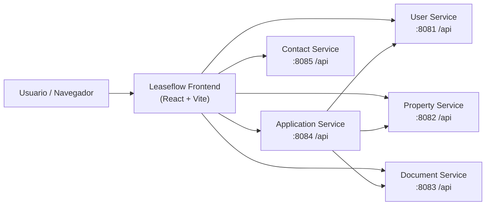
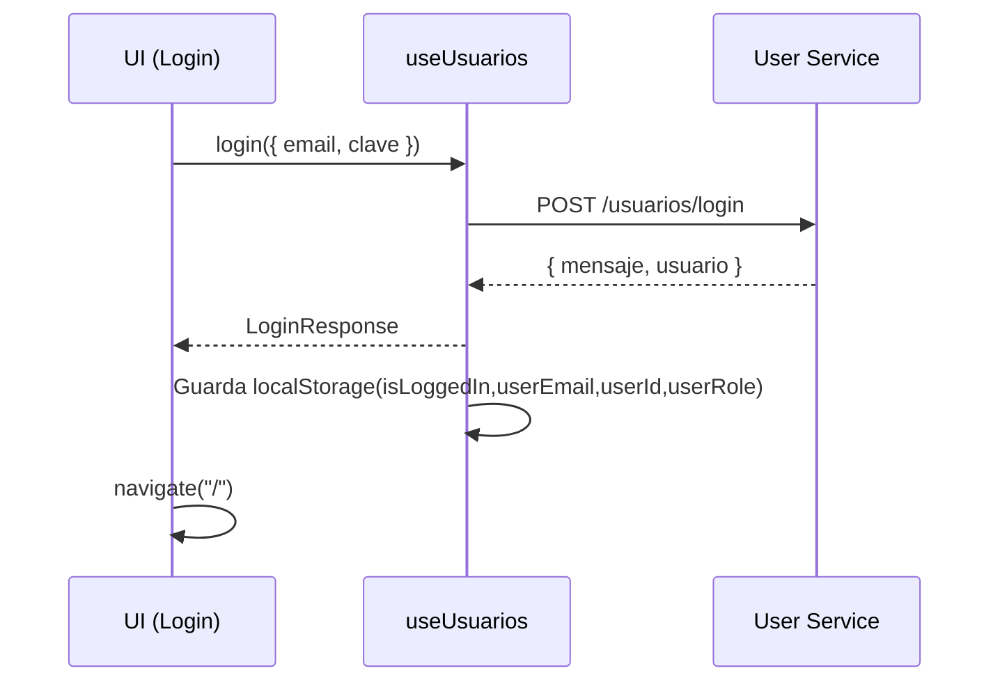
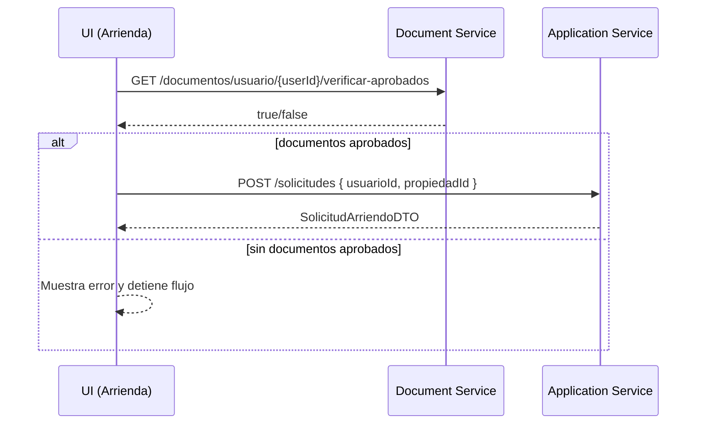

# Leaseflow (Frontend)

Aplicación web (SPA) para arriendo inmobiliario directo y sin comisiones, construida con React + TypeScript + Vite. Este repositorio contiene únicamente el frontend y se integra con una arquitectura de microservicios.

## Tabla de contenidos

- [Resumen](#resumen)
- [Tecnologías](#tecnologías)
- [Arquitectura](#arquitectura)
- [Modelo de datos (DTOs)](#modelo-de-datos-dtos)
- [Ejecución local](#ejecución-local)
- [Scripts](#scripts)
- [Estructura del proyecto](#estructura-del-proyecto)
- [Flujos clave](#flujos-clave)
- [Pruebas y calidad](#pruebas-y-calidad)
- [Troubleshooting](#troubleshooting)

## Resumen

Leaseflow permite:

- Registro e inicio de sesión.
- Visualización de propiedades disponibles y postulación a arriendo.
- Gestión de propiedades por propietario (y vista global para admin).
- Gestión de documentos por el usuario (carga) y revisión por admin (aprobación/rechazo).
- Formulario de contacto integrado con un servicio dedicado.
- Sección de valoraciones (UI local, sin persistencia).

## Tecnologías

- Runtime/build: Vite
- UI: React, React Router DOM, Bootstrap 5
- Lenguaje: TypeScript
- Calidad: ESLint
- Pruebas: Vitest + Testing Library (entorno jsdom)

## Arquitectura

### Vista general

El frontend consume varios microservicios HTTP. Las URLs se centralizan en [apiConfig.ts](src/config/apiConfig.ts).



### Microservicios esperados (puertos por defecto)

| Servicio | Puerto | Base URL por defecto | Propósito |
|---|---:|---|---|
| User Service | 8081 | `http://localhost:8081/api` | Autenticación y usuarios |
| Property Service | 8082 | `http://localhost:8082/api` | Propiedades, comunas, tipos, fotos |
| Document Service | 8083 | `http://localhost:8083/api` | Documentos de usuarios (estados / tipos) |
| Application Service | 8084 | `http://localhost:8084/api` | Solicitudes y registros de arriendo |
| Contact Service | 8085 | `http://localhost:8085/api` | Mensajes de contacto |
| Review Service | 8086 | `http://localhost:8086/api` | Reservado en config (no usado en UI actual) |

### Routing (SPA)

Las rutas están definidas en [App.tsx](src/App.tsx):

| Ruta | Pantalla | Notas |
|---|---|---|
| `/` | Home | Landing |
| `/nosotros` | Nosotros | Info de la plataforma |
| `/arrienda` | Arrienda | Lista propiedades + postulación |
| `/contacto` | Contacto | Envío de mensaje al Contact Service |
| `/login` | Login | Login contra User Service |
| `/registro` | Registro | Registro + “carga” de documentos |
| `/perfil` | Perfil | Datos del usuario y documentos |
| `/gestion-propiedades` | Gestión Propiedades | Propietario/Admin |
| `/gestion-documentos` | Gestión Documentos | Admin |
| `/valoraciones` | Valoraciones | UI local |

### “Sesión” y permisos (frontend)

El estado de sesión se modela con `localStorage` (no hay JWT en este frontend):

- `isLoggedIn`: `"true" | null`
- `userEmail`: string
- `userId`: string (numérico)
- `userRole`: `"ADMIN" | "PROPIETARIO" | "ARRIENDATARIO"`

La barra de navegación y algunas pantallas realizan validación por rol/estado leyendo estas claves (ej.: [useUsuarios.ts](src/hooks/useUsuarios.ts), [GestionDocumentos.tsx](src/paginas/GestionDocumentos.tsx), [GestionPropiedades.tsx](src/paginas/GestionPropiedades.tsx)).

Nota: esto es control UI, no seguridad real. La autorización debe estar reforzada en backend.

## Modelo de datos (DTOs)

Los tipos principales del dominio se encuentran en [types/index.ts](src/types/index.ts) y se usan a través de los clientes HTTP en [src/api](src/api).

Entidades relevantes:

- Usuario: `UsuarioDTO` (incluye rol, estado, puntos, duocVip, código de referido).
- Propiedad: `PropiedadDTO` (dirección, precio, m2, habitaciones/baños, fotos, comuna/tipo).
- Documento: `DocumentoDTO` (estadoId, tipoDocId, usuarioId).
- Solicitud de arriendo: `SolicitudArriendoDTO` (estado, usuario, propiedad).
- Registro de arriendo: `RegistroArriendoDTO` (vigencia y monto).
- Contacto: `MensajeContactoDTO` (definido en [contactService.ts](src/api/contactService.ts)).

### Estados y tipos de documento (IDs usados en UI)

- Estados: 1=PENDIENTE, 2=ACEPTADO, 3=RECHAZADO, 4=EN_REVISION (ver [useDocumentos.ts](src/hooks/useDocumentos.ts) y [GestionDocumentos.tsx](src/paginas/GestionDocumentos.tsx))
- Tipos (registro): 1=DNI, 2=Pasaporte, 3=Liquidación, 4=Antecedentes, 5=AFP, 6=Contrato (ver [Registro.tsx](src/paginas/Registro.tsx))

## Ejecución local

### Requisitos

- Node.js 20+ recomendado (Vite 7)
- Backends (microservicios) ejecutándose en los puertos configurados

### Instalación y ejecución

```bash
npm install
npm run dev
```

La aplicación quedará disponible en la URL que muestre Vite (por defecto suele ser `http://localhost:5173`).

### Configuración de microservicios

Editar [apiConfig.ts](src/config/apiConfig.ts) para cambiar URLs/puertos si es necesario.

## Scripts

Definidos en [package.json](package.json):

```bash
npm run dev       # entorno de desarrollo
npm run build     # build producción (tsc + vite build)
npm run preview   # preview del build
npm run lint      # eslint .
npm run test      # vitest run
npm run test:ui   # vitest (modo watch/UI)
```

## Estructura del proyecto

```text
src/
  api/            Clientes HTTP por microservicio
  config/         Config global (URLs, constantes de dominio)
  hooks/          Hooks de dominio (estado + llamadas a servicios)
  paginas/        Pantallas (rutas)
  test/           Tests (Vitest + Testing Library)
  types/          DTOs y tipos compartidos
  main.tsx        Entry point (BrowserRouter + Bootstrap)
  App.tsx         Router + layout (navbar/footer)
```

Notas:

- Alias `@/` hacia `src/` configurado en [vite.config.ts](vite.config.ts).
- Bootstrap se importa en [main.tsx](src/main.tsx) y estilos custom en [App.css](src/App.css).

## Flujos clave

### Login

El login se realiza contra `POST /usuarios/login` del User Service y, si es exitoso, se guarda la “sesión” en `localStorage` (ver [useUsuarios.ts](src/hooks/useUsuarios.ts)).



Mapeo de roles en frontend (según `rolId` del backend):

- `1 -> ADMIN`
- `2 -> PROPIETARIO`
- `3 -> ARRIENDATARIO`

### Registro (2 pasos) + documentos

Registro se divide en:

1. Datos personales + rol + validaciones locales.
2. Documentos (algunos obligatorios) que quedan “pendientes” para revisión.

Importante: actualmente no se sube el archivo como binario; se envía un registro con `nombre` como el nombre del archivo (ver [Registro.tsx](src/paginas/Registro.tsx)). La carga real a storage/BD debe implementarse en backend y/o en el cliente.

### Postulación a arriendo

La postulación desde [arrienda.tsx](src/paginas/arrienda.tsx) valida:

- Usuario logueado (`localStorage`)
- Documentos aprobados (Document Service)
- Creación de solicitud (Application Service)



## Pruebas y calidad

- Tests: se ubican en [src/test](src/test) y se ejecutan con `npm run test`.
- Setup de testing: [setupTests.ts](src/setupTests.ts) (jsdom + matchers).
- Lint: `npm run lint` (config: [eslint.config.js](eslint.config.js)).

## Troubleshooting

- Error “Failed to fetch”: usualmente significa microservicio apagado o CORS no configurado. Verifica que los puertos `8081..8085` estén activos y que el backend permita requests desde `http://localhost:5173`.
- “Acceso denegado” en pantallas admin: la UI valida `userRole === ADMIN`. Revisa `localStorage.userRole` y el `rolId` que devuelve el backend.
- “Debes tener al menos un documento aprobado para postular”: el Document Service debe retornar `true` en el endpoint de verificación de aprobados para el usuario.
